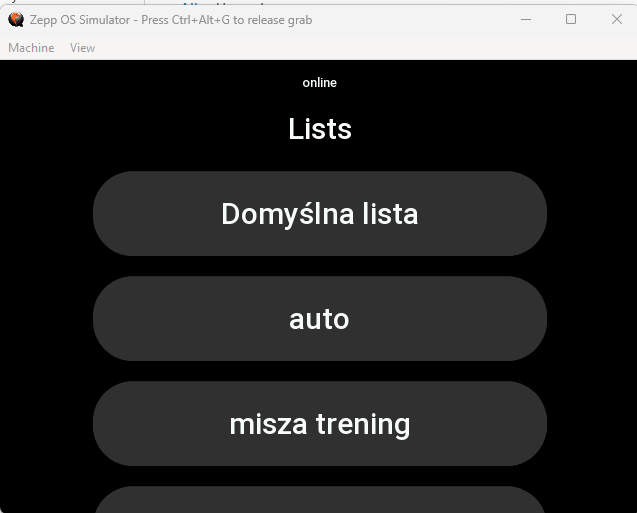
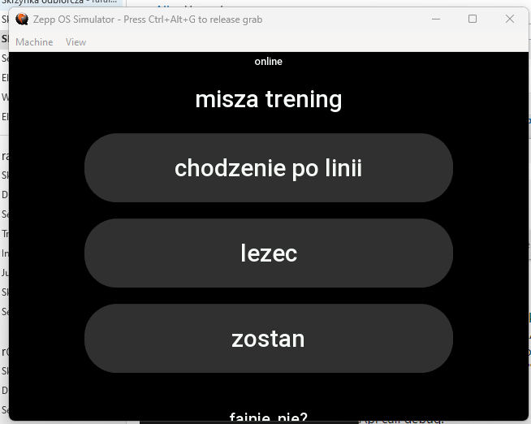

# Google Tasks integration app
Bonjour! this app will allow you to manage your google tasks from your watch.

for more detailed description check official website: https://apps.klimonda.pl/gtasts

> **Warning**
> Before first use - go to settings and click `Click here to authorize`.

# Google Tasks API
This app needs file `env.js` to work. i don't want to put my secrets to git so if u want to test by yourself rename file `env.js.sample` and put your credentials to google tasks api: https://console.cloud.google.com/apis/api/tasks.googleapis.com

# Application
## Lists:

If no default list is selected, on startup app will show all lists assigned to current user:

once u click on any it will open and be set as default list when opening.

## Tasks
Tasks page will display all visible and not completed tasks on current list.

to go back to Lists -> Swipe left.
when u click on task it'll be marked as complete.

## top panel
on top panel u can see following states of app:
- cache - displayed data is showed from cache
- online - displayed data is synchronized with online data
- loading - still fetching data (nothing yet in cache)

if you see toast "error" please go to settings app and see content. probably need to authorize google api again

# todo
- add standalone mode for watch (save finished tasks in watch and synchronize them once will connect to phone)
- add offline mode (the same as above, but without internet)
- better error toast when sth goes wrong
- consider adding dialog for confirming task on watch. maybe configurable in settings?
- ???